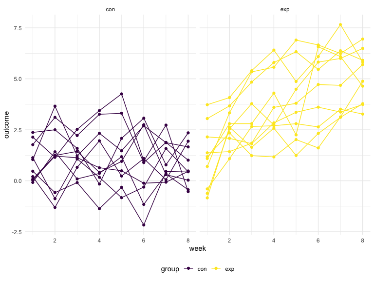
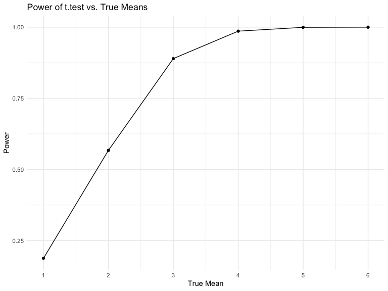
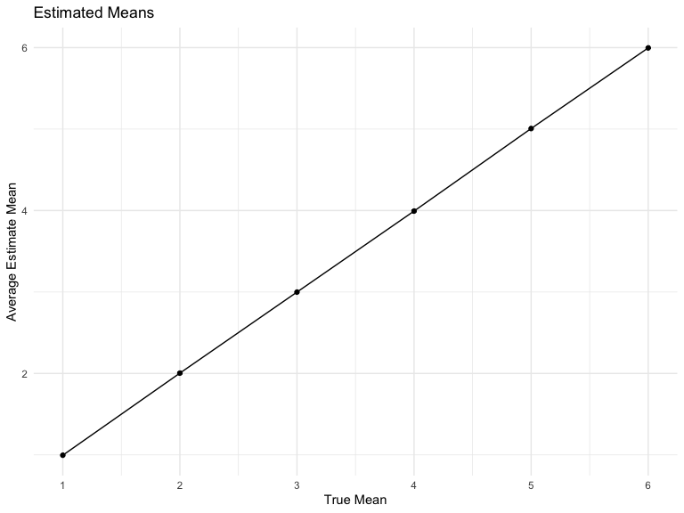
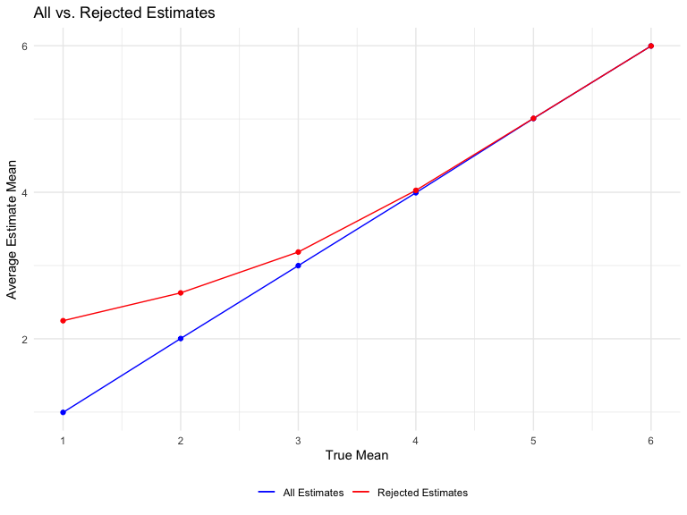

p8105_hw5_jc5457
================

### Due date

Due: November 16 at 11:59pm.

### Points

| Problem         | Points    |
|:----------------|:----------|
| Problem 0       | 20        |
| Problem 1       | –         |
| Problem 2       | 40        |
| Problem 3       | 40        |
| Optional survey | No points |

### Problem 0

This “problem” focuses on structure of your submission, especially the
use git and GitHub for reproducibility, R Projects to organize your
work, R Markdown to write reproducible reports, relative paths to load
data from local files, and reasonable naming structures for your files.
This was not prepared as a GitHub repo.

``` r
library(tidyverse)
```

## Problem 1

The code chunk below imports the data in individual spreadsheets
contained in `./data/zip_data/`. To do this, I create a dataframe that
includes the list of all files in that directory and the complete path
to each file. As a next step, I `map` over paths and import data using
the `read_csv` function. Finally, I `unnest` the result of `map`.

``` r
full_df = 
  tibble(
    files = list.files("data/zip_data/"),
    path = str_c("data/zip_data/", files)
  ) %>% 
  mutate(data = map(path, read_csv)) %>% 
  unnest()
```

    ## Rows: 1 Columns: 8
    ## ── Column specification ────────────────────────────────────────────────────────
    ## Delimiter: ","
    ## dbl (8): week_1, week_2, week_3, week_4, week_5, week_6, week_7, week_8
    ## 
    ## ℹ Use `spec()` to retrieve the full column specification for this data.
    ## ℹ Specify the column types or set `show_col_types = FALSE` to quiet this message.
    ## Rows: 1 Columns: 8
    ## ── Column specification ────────────────────────────────────────────────────────
    ## Delimiter: ","
    ## dbl (8): week_1, week_2, week_3, week_4, week_5, week_6, week_7, week_8
    ## 
    ## ℹ Use `spec()` to retrieve the full column specification for this data.
    ## ℹ Specify the column types or set `show_col_types = FALSE` to quiet this message.
    ## Rows: 1 Columns: 8
    ## ── Column specification ────────────────────────────────────────────────────────
    ## Delimiter: ","
    ## dbl (8): week_1, week_2, week_3, week_4, week_5, week_6, week_7, week_8
    ## 
    ## ℹ Use `spec()` to retrieve the full column specification for this data.
    ## ℹ Specify the column types or set `show_col_types = FALSE` to quiet this message.
    ## Rows: 1 Columns: 8
    ## ── Column specification ────────────────────────────────────────────────────────
    ## Delimiter: ","
    ## dbl (8): week_1, week_2, week_3, week_4, week_5, week_6, week_7, week_8
    ## 
    ## ℹ Use `spec()` to retrieve the full column specification for this data.
    ## ℹ Specify the column types or set `show_col_types = FALSE` to quiet this message.
    ## Rows: 1 Columns: 8
    ## ── Column specification ────────────────────────────────────────────────────────
    ## Delimiter: ","
    ## dbl (8): week_1, week_2, week_3, week_4, week_5, week_6, week_7, week_8
    ## 
    ## ℹ Use `spec()` to retrieve the full column specification for this data.
    ## ℹ Specify the column types or set `show_col_types = FALSE` to quiet this message.
    ## Rows: 1 Columns: 8
    ## ── Column specification ────────────────────────────────────────────────────────
    ## Delimiter: ","
    ## dbl (8): week_1, week_2, week_3, week_4, week_5, week_6, week_7, week_8
    ## 
    ## ℹ Use `spec()` to retrieve the full column specification for this data.
    ## ℹ Specify the column types or set `show_col_types = FALSE` to quiet this message.
    ## Rows: 1 Columns: 8
    ## ── Column specification ────────────────────────────────────────────────────────
    ## Delimiter: ","
    ## dbl (8): week_1, week_2, week_3, week_4, week_5, week_6, week_7, week_8
    ## 
    ## ℹ Use `spec()` to retrieve the full column specification for this data.
    ## ℹ Specify the column types or set `show_col_types = FALSE` to quiet this message.
    ## Rows: 1 Columns: 8
    ## ── Column specification ────────────────────────────────────────────────────────
    ## Delimiter: ","
    ## dbl (8): week_1, week_2, week_3, week_4, week_5, week_6, week_7, week_8
    ## 
    ## ℹ Use `spec()` to retrieve the full column specification for this data.
    ## ℹ Specify the column types or set `show_col_types = FALSE` to quiet this message.
    ## Rows: 1 Columns: 8
    ## ── Column specification ────────────────────────────────────────────────────────
    ## Delimiter: ","
    ## dbl (8): week_1, week_2, week_3, week_4, week_5, week_6, week_7, week_8
    ## 
    ## ℹ Use `spec()` to retrieve the full column specification for this data.
    ## ℹ Specify the column types or set `show_col_types = FALSE` to quiet this message.
    ## Rows: 1 Columns: 8
    ## ── Column specification ────────────────────────────────────────────────────────
    ## Delimiter: ","
    ## dbl (8): week_1, week_2, week_3, week_4, week_5, week_6, week_7, week_8
    ## 
    ## ℹ Use `spec()` to retrieve the full column specification for this data.
    ## ℹ Specify the column types or set `show_col_types = FALSE` to quiet this message.
    ## Rows: 1 Columns: 8
    ## ── Column specification ────────────────────────────────────────────────────────
    ## Delimiter: ","
    ## dbl (8): week_1, week_2, week_3, week_4, week_5, week_6, week_7, week_8
    ## 
    ## ℹ Use `spec()` to retrieve the full column specification for this data.
    ## ℹ Specify the column types or set `show_col_types = FALSE` to quiet this message.
    ## Rows: 1 Columns: 8
    ## ── Column specification ────────────────────────────────────────────────────────
    ## Delimiter: ","
    ## dbl (8): week_1, week_2, week_3, week_4, week_5, week_6, week_7, week_8
    ## 
    ## ℹ Use `spec()` to retrieve the full column specification for this data.
    ## ℹ Specify the column types or set `show_col_types = FALSE` to quiet this message.
    ## Rows: 1 Columns: 8
    ## ── Column specification ────────────────────────────────────────────────────────
    ## Delimiter: ","
    ## dbl (8): week_1, week_2, week_3, week_4, week_5, week_6, week_7, week_8
    ## 
    ## ℹ Use `spec()` to retrieve the full column specification for this data.
    ## ℹ Specify the column types or set `show_col_types = FALSE` to quiet this message.
    ## Rows: 1 Columns: 8
    ## ── Column specification ────────────────────────────────────────────────────────
    ## Delimiter: ","
    ## dbl (8): week_1, week_2, week_3, week_4, week_5, week_6, week_7, week_8
    ## 
    ## ℹ Use `spec()` to retrieve the full column specification for this data.
    ## ℹ Specify the column types or set `show_col_types = FALSE` to quiet this message.
    ## Rows: 1 Columns: 8
    ## ── Column specification ────────────────────────────────────────────────────────
    ## Delimiter: ","
    ## dbl (8): week_1, week_2, week_3, week_4, week_5, week_6, week_7, week_8
    ## 
    ## ℹ Use `spec()` to retrieve the full column specification for this data.
    ## ℹ Specify the column types or set `show_col_types = FALSE` to quiet this message.
    ## Rows: 1 Columns: 8
    ## ── Column specification ────────────────────────────────────────────────────────
    ## Delimiter: ","
    ## dbl (8): week_1, week_2, week_3, week_4, week_5, week_6, week_7, week_8
    ## 
    ## ℹ Use `spec()` to retrieve the full column specification for this data.
    ## ℹ Specify the column types or set `show_col_types = FALSE` to quiet this message.
    ## Rows: 1 Columns: 8
    ## ── Column specification ────────────────────────────────────────────────────────
    ## Delimiter: ","
    ## dbl (8): week_1, week_2, week_3, week_4, week_5, week_6, week_7, week_8
    ## 
    ## ℹ Use `spec()` to retrieve the full column specification for this data.
    ## ℹ Specify the column types or set `show_col_types = FALSE` to quiet this message.
    ## Rows: 1 Columns: 8
    ## ── Column specification ────────────────────────────────────────────────────────
    ## Delimiter: ","
    ## dbl (8): week_1, week_2, week_3, week_4, week_5, week_6, week_7, week_8
    ## 
    ## ℹ Use `spec()` to retrieve the full column specification for this data.
    ## ℹ Specify the column types or set `show_col_types = FALSE` to quiet this message.
    ## Rows: 1 Columns: 8
    ## ── Column specification ────────────────────────────────────────────────────────
    ## Delimiter: ","
    ## dbl (8): week_1, week_2, week_3, week_4, week_5, week_6, week_7, week_8
    ## 
    ## ℹ Use `spec()` to retrieve the full column specification for this data.
    ## ℹ Specify the column types or set `show_col_types = FALSE` to quiet this message.
    ## Rows: 1 Columns: 8
    ## ── Column specification ────────────────────────────────────────────────────────
    ## Delimiter: ","
    ## dbl (8): week_1, week_2, week_3, week_4, week_5, week_6, week_7, week_8
    ## 
    ## ℹ Use `spec()` to retrieve the full column specification for this data.
    ## ℹ Specify the column types or set `show_col_types = FALSE` to quiet this message.

The result of the previous code chunk isn’t tidy – data are wide rather
than long, and some important variables are included as parts of others.
The code chunk below tides the data using string manipulations on the
file, converting from wide to long, and selecting relevant variables.

``` r
tidy_df = 
  full_df %>% 
  mutate(
    files = str_replace(files, ".csv", ""),
    group = str_sub(files, 1, 3)) %>% 
  pivot_longer(
    week_1:week_8,
    names_to = "week",
    values_to = "outcome",
    names_prefix = "week_") %>% 
  mutate(week = as.numeric(week)) %>% 
  select(group, subj = files, week, outcome)
```

Finally, the code chunk below creates a plot showing individual data,
faceted by group.

``` r
tidy_df %>% 
  ggplot(aes(x = week, y = outcome, group = subj, color = group)) + 
  geom_point() + 
  geom_path() + 
  facet_grid(~group)
```



This plot suggests high within-subject correlation – subjects who start
above average end up above average, and those that start below average
end up below average. Subjects in the control group generally don’t
change over time, but those in the experiment group increase their
outcome in a roughly linear way.

## Problem 2

The Washington Post collected data on more than 52,000 criminal
homicides over the past decade in 50 of the largest American cities.

``` r
homicide_df = read.csv("./data/homicide-data.csv", na = c("","Unknown"))
```

Describe the raw data:

This dataset contains 52179 rows and 12 columns. The variable names in
this dataset are: uid, reported_date, victim_last, victim_first,
victim_race, victim_age, victim_sex, city, state, lat, lon, disposition.

Create a city_state variable (e.g. “Baltimore, MD”) and then summarize
within cities to obtain the total number of homicides and the number of
unsolved homicides (those for which the disposition is “Closed without
arrest” or “Open/No arrest”).

``` r
homicide_df =
  homicide_df %>% 
  mutate(city_state = str_c(city,state),
         resolution = case_when(
           disposition == "Closed without arrest" ~ "unsolved",
           disposition == "Open/No arrest" ~ "unsolved",
           disposition == "Closed by arrest" ~ "solved")
         ) %>%
  relocate(city_state) %>% 
  filter(city_state != "TulsaAL")
count(homicide_df, disposition)
```

    ##             disposition     n
    ## 1      Closed by arrest 25673
    ## 2 Closed without arrest  2922
    ## 3        Open/No arrest 23583

For the city of Baltimore, MD, use the prop.test function to estimate
the proportion of homicides that are unsolved; save the output of
prop.test as an R object `baltimore_test`, apply the broom::tidy to this
object and pull the estimated proportion and confidence intervals from
the resulting tidy dataframe.

``` r
baltimore_df =
  homicide_df %>% 
  filter(city_state == "BaltimoreMD")

baltimore_summary = 
  baltimore_df %>% 
    summarize(
      unsolved = sum(resolution == "unsolved"),
      n = n()
    )

baltimore_test = 
  prop.test(
    x = baltimore_summary %>% pull(unsolved),
    n = baltimore_summary %>% pull(n)
    )

baltimore_test %>% 
  broom::tidy()
```

    ## # A tibble: 1 × 8
    ##   estimate statistic  p.value parameter conf.low conf.high method        alter…¹
    ##      <dbl>     <dbl>    <dbl>     <int>    <dbl>     <dbl> <chr>         <chr>  
    ## 1    0.646      239. 6.46e-54         1    0.628     0.663 1-sample pro… two.si…
    ## # … with abbreviated variable name ¹​alternative

Now run prop.test for each of the cities in your dataset, and extract
both the proportion of unsolved homicides and the confidence interval
for each. Do this within a “tidy” pipeline, making use of `purrr::map`,
`purrr::map2`, list columns and unnest as necessary to create a tidy
dataframe with estimated proportions and CIs for each city
(`results_df`).

-   write a prop test function

``` r
prop_test_fuction = function(city_df){
  city_summary = 
    city_df %>% 
    summarize(
      unsolved = sum(resolution == "unsolved"),
      n = n()
    )
  
  city_test = 
    prop.test(
      x = city_summary %>% pull(unsolved),
      n = city_summary %>% pull(n)
      )
  
  return(city_test)
}
```

-   Iterate across city

``` r
results_df = 
  homicide_df %>% 
  nest(data = uid:resolution) %>% 
  mutate(
    test_results = map(data, prop_test_fuction),
    tidy_results = map(test_results, broom::tidy)
  ) %>% 
  select(city_state, tidy_results) %>% 
  unnest(tidy_results) %>% 
  select(city_state, estimate, starts_with("conf"))

results_df
```

    ## # A tibble: 50 × 4
    ##    city_state    estimate conf.low conf.high
    ##    <chr>            <dbl>    <dbl>     <dbl>
    ##  1 AlbuquerqueNM    0.386    0.337     0.438
    ##  2 AtlantaGA        0.383    0.353     0.415
    ##  3 BaltimoreMD      0.646    0.628     0.663
    ##  4 Baton RougeLA    0.462    0.414     0.511
    ##  5 BirminghamAL     0.434    0.399     0.469
    ##  6 BostonMA         0.505    0.465     0.545
    ##  7 BuffaloNY        0.612    0.569     0.654
    ##  8 CharlotteNC      0.300    0.266     0.336
    ##  9 ChicagoIL        0.736    0.724     0.747
    ## 10 CincinnatiOH     0.445    0.408     0.483
    ## # … with 40 more rows

Create a plot that shows the estimates and CIs for each city – check out
`geom_errorbar` for a way to add error bars based on the upper and lower
limits. Organize cities according to the proportion of unsolved
homicides.

``` r
results_df %>% 
  mutate(city_state = fct_reorder(city_state, estimate)) %>% 
  ggplot(aes(x = city_state, y = estimate)) +
  geom_point() +
  geom_errorbar(aes(ymin = conf.low, ymax = conf.high)) +
  theme(axis.text.x = element_text(angle = 90, vjust = 0.5, hjust =1))
```


## Problem 3

Conduct a simulation to explore power in a one-sample t-test.

First set the following design elements:

-   Fix n=30
-   Fix σ=5

Set μ=0. Generate 5000 datasets from the model. x∼Normal\[μ,σ\]

``` r
sample = rerun(5000, rnorm(n = 30,mean = 0,sd = 5))
```

-   Write t test function

``` r
t_test = function(mu = 0) {
  sample = tibble(rnorm(n = 30, mean = mu, sd = 5))
  
  result = t.test(sample) %>% 
    broom::tidy() %>% 
    select(estimate,p.value)
  
  result
}
```

-   Apply t test function to the 5000 samples (mean = 0)

For each dataset, save μ̂ and the p-value arising from a test of H:μ=0
using α=0.05.

``` r
mean_0 = expand_grid(mean = 0, iteration = 1:5000) %>% 
  mutate(result = map(mean,t_test)) %>% 
  unnest(result)
dim(mean_0)
```

    ## [1] 5000    4

``` r
head(mean_0)
```

    ## # A tibble: 6 × 4
    ##    mean iteration estimate p.value
    ##   <dbl>     <int>    <dbl>   <dbl>
    ## 1     0         1    0.814   0.391
    ## 2     0         2   -0.504   0.555
    ## 3     0         3   -0.647   0.484
    ## 4     0         4    0.381   0.622
    ## 5     0         5   -0.338   0.702
    ## 6     0         6    0.658   0.469

-   Repeat the above for μ={1,2,3,4,5,6}

``` r
mean_6 = expand_grid(mean = 1:6, iteration = 1:5000) %>% 
  mutate(result = map(mean,t_test)) %>% 
  unnest(result)
dim(mean_6)
```

    ## [1] 30000     4

``` r
head(mean_6)
```

    ## # A tibble: 6 × 4
    ##    mean iteration estimate p.value
    ##   <int>     <int>    <dbl>   <dbl>
    ## 1     1         1    1.66   0.0977
    ## 2     1         2    0.391  0.643 
    ## 3     1         3   -0.457  0.644 
    ## 4     1         4    2.28   0.0425
    ## 5     1         5    0.143  0.868 
    ## 6     1         6    1.10   0.242

Make a plot showing the proportion of times the null was rejected (the
power of the test) on the y axis and the true value of μ on the x axis.

``` r
mean_6 %>%
  group_by(mean) %>% 
  summarize(proportion_rejected = sum(p.value < 0.05)/5000) %>% 
  ggplot(aes(x = mean,y = proportion_rejected)) +
  scale_x_continuous(limits = c(1,6), breaks = seq(1,6,1)) + 
  geom_point() + geom_path() +
  labs(x = "True Mean",y = "Power",title = "Power of t.test vs. True Means")
```



From the plot, we can see that the association between effect size and
power is:

1.  When true mean (effect size) increases, power (proportion of
    rejection) also increases.

2.  The speed of power’s increase (slop of the plot) slower down as true
    mean increases.

Make a plot showing the average estimate of μ̂ on the y axis and the true
value of μ on the x axis.

``` r
mean_6 %>%
  group_by(mean) %>% 
  summarize(average_estimate = mean(estimate,na.rm = T)) %>% 
  ggplot(aes(x = mean,y = average_estimate)) +
  scale_x_continuous(limits = c(1,6), breaks = seq(1,6,1)) + 
  geom_point() + geom_path() +
  labs(x = "True Mean",y = "Average Estimate Mean",title = "Estimated Means")
```



Make a second plot (or overlay on the first) the average estimate of μ̂
only in samples for which the null was rejected on the y axis and the
true value of μ on the x axis.

``` r
rejected_estimate <- mean_6 %>% 
  filter(p.value < 0.05) %>% group_by(mean) %>% 
  summarize(average_estimate = mean(estimate,na.rm = T)) %>% 
  ungroup()

full_estimate <- mean_6 %>% 
  group_by(mean) %>% 
  summarize(average_estimate = mean(estimate,na.rm = T)) %>% 
  ungroup()
  
ggplot(full_estimate,aes(x = mean, y = average_estimate)) +
  geom_line(data = full_estimate,aes(colour = "blue")) +
  geom_line(data = rejected_estimate,aes(colour = "red")) +
  scale_color_manual(name = " ", values = c("blue" = "blue", "red" = "red"),
                     labels = c('All Estimates','Rejected Estimates'))+
  geom_point(data = full_estimate,colour = "blue") +
  geom_point(data = rejected_estimate,colour = "red") +
  scale_x_continuous(limits = c(1,6), breaks = seq(1,6,1)) +
  labs(x = "True Mean",y = "Average Estimate Mean",title = "All vs. Rejected Estimates")
```



From the plot, we can see that:

1.  When the effect size is less than 4, the sample average of μ̂ when
    the null is rejected is very different from (and always larger than)
    the true value of μ.

2.  When the effect size is larger than 4, the sample average of μ̂ when
    the null is rejected is approximately equal to the true value of μ.
    That’s because as the power is increasing.

Conclusion:

Given the small sample size and low power, and given that the null is
rejected, we can see the average is very different from the true mean.

When the power is low, the sample size is small, the results that the
null is rejected may be far away from the truth.
